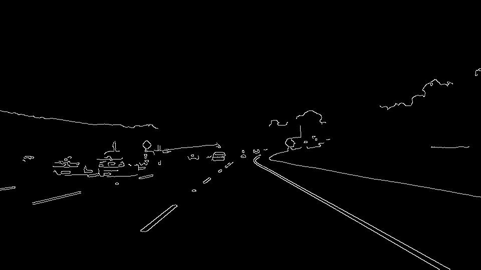

# **Finding Lane Lines on the Road** 
In this project is I have a developed a pipeline to detect the Lane Lines on the Road and applied extrapolated the detected line. The detected Lane Line is drawn over the original image. Explained **Lane detection pipeline, potential shorting coming and possible improvements** below,

## **Lane detection pipeline**
---
The images in folder test_images, solidWhiteRight.mp4 and solidYellowLeft.mp4 are processed using the Lane line detection pipeline. The results are stored in test_image_ouput and test_videos_output folder respectively. Below I have explained the different process which has been carried out on the image and video for detecting the Lane Lines.

### **Process the orginal image**
*   Converted the image to **Gray Scale Image**.

    Image Before Appling Gray Scale| Gray Scaled image
    :---:|:---:
      |  

*   Applied Gaussian blur with a **Kernal Size** of **5** over the **Gray Scale Image** for reducing the Noises in the image.

    Before Appling Gaussian blur| After Appling Gaussian blur
    :---:|:---:
      |  

### **Detect edges in the preprocessed image**
*   For detecting the Edges from the Processed image, we use Canny Edge detection. 
*   We use OpenCV canny function for the edge detection were the edges will be decided based on the **max threshold** and **min threshold** values. 
*   Any edges with intensity gradient **more than max threshold** are sure to be **edges** and those **below min threshold** are sure to be **non-edges** so will be discarded. Edges which lie between these max threshold and min threshold are considered as edges if they are connected to an edge pixel, otherwise they are non-edge so will be discarded.

Gaussian blurred image| Edge detected image
:---:|:---:
  |  

### **Selecting the region of interest**
*   Since we are only interested in finding the lane line on the road, we can exclude the pixel which are not in the region of the lane lines.
*  To select the region of interest from the image, we have to create **mask image** by using OpenCV function **fillpoly** which will fill the pixels inside a polygon defined by the input **vertices** with fill color.
*  The vertices (bottom_left, top_left, top_right, bottom_right) are selected by assuming that the image is capture by placing the camera at the center of the image.
*   The region of interest is selected by masking the edge detected image with the mask image

Edge detected image| selected region from the image
:---:|:---:
  |  

### **Draw lines by using the edges**
*   To draw the lines from the edges detected from canny edge detection we use **hough transformation**.
*   we use OpenCV function HoughLinesP to get the line details based on the edges, for getting a proper line from the edges a optimal values should be set for the following parameters Rho, theta, threshold, minLineLength, maxLineGap.

Edge detected image| Hough lines image
:---:|:---:
  |  

### **Average/Extrapolate the lines from hough lines**
The hough lines are Average/Extrapolate by using the equation of a **Straight Line** i.e. **y=mx+C**. Explained in detail below,

*   Initially the left and right lines of the Lane are differentiate by using the **slope of the line(i.e. m = (y2-y1)/(x2-x1))**. 
*   If slope(m) is less than zero then lines will be left line of the lane and if the slope(m) is greater than zero then lines will be right line of the lane. during the testing of the test video, the Lines where getting messed up due to some false lane lines. So, the lines with slope -0.1 > slope < 0.1 are rejected.
*   From the segregated lines the average of vertices and slope are calculated, which is used to calculate the intercept of the line using the equation **c= y - (m * x)**.
*    By considering the Ymax value as image ymax and Ymin value as the min y value in hough line values which will be calculated during the segregation of left and right lane lines.
*   so by using the equation **x = (y - c)/m** and keeping the ymin and ymax the top and bottom x values are calculated separately for the left and right line
* finally using the values top_x,bottom_x,ymin,ymax the line is drawn over the lane.

     

    **Code snippet:**

        def draw_lines(img, lines, color=[255, 0, 0], thickness=2):
        """
        NOTE: this is the function you might want to use as a starting point once you want to 
        average/extrapolate the line segments you detect to map out the full
        extent of the lane (going from the result shown in raw-lines-example.mp4
        to that shown in P1_example.mp4).  
        
        Think about things like separating line segments by their 
        slope ((y2-y1)/(x2-x1)) to decide which segments are part of the left
        line vs. the right line.  Then, you can average the position of each of 
        the lines and extrapolate to the top and bottom of the lane.
        
        This function draws `lines` with `color` and `thickness`.    
        Lines are drawn on the image inplace (mutates the image).
        If you want to make the lines semi-transparent, think about combining
        this function with the weighted_img() function below
        """
        #variable delaration
        Ymax = img.shape[0]
        Ymin = img.shape[0]
        
        left_X = []
        left_Y = []
        left_slope = []
        right_X = []
        right_Y = []
        right_slope = []
    
        #read the lines and segregate it as LEFT and RIGHT lines of the Lane 
        for line in lines:
            for x1,y1,x2,y2 in line:
                #calculate the slope of line using numpy polyfit
                slope, intercept = np.polyfit((x1,x2),(y1,y2),1)
                
                # calculate the minimum Y value
                Ymin = min(min(y1,y2),Ymin)
                
                #Since there were some lines which was wrongly detected 
                #So the lines with slope -0.1 > slope < 0.1 are not considered
                #if the slope is less than -0.1 then the line is in LEFT
                if(slope< -0.1):
                    #group the LEFT line detail
                    left_X.append(x1)
                    left_X.append(x2)
                    left_Y.append(y1)
                    left_Y.append(y2)
                    left_slope.append(slope)
                #if the slope is greater than 0.1 then the line is in RIGHT
                elif(slope > 0.1):
                    #group the RIGHT line detail
                    right_X.append(x1)
                    right_X.append(x2)
                    right_Y.append(y1)
                    right_Y.append(y2)
                    right_slope.append(slope)
                    
        #calculate the average of value of left x,y and slope
        left_X_average = np.average(left_X)
        left_Y_average = np.average(left_Y)
        left_slope_average = np.average(left_slope)
        #calculate the left line intercept which will be used for calculating the x upper and lower value
        left_intercept = left_Y_average - (left_slope_average * left_X_average)
        
        #calculate the average of value of right x,y and slope
        right_X_average = np.average(right_X)
        right_Y_average = np.average(right_Y)
        right_slope_average = np.average(right_slope)
        #calculate the right line intercept which will be used for calculating the x upper and lower value
        right_intercept = right_Y_average - (right_slope_average * right_X_average)
        
        #check if the array is not empty 
        #because while running the images from the video there some empty array 
        if((len(left_slope)>0) and (len(right_slope)>0)): 
            #calculate left upper and lower X value
            left_X1 = int((Ymax - left_intercept)/left_slope_average)
            left_X2 = int((Ymin - left_intercept)/left_slope_average)
            #calculate right upper and lower Y value
            right_X1 = int((Ymax - right_intercept)/right_slope_average)
            right_X2 = int((Ymin - right_intercept)/right_slope_average)

            #plot the LEFT and RIGHT lines over the image
            cv2.line(img, (right_X2, Ymin),(right_X1, Ymax), color, thickness)
            cv2.line(img, (left_X1, Ymax), (left_X2, Ymin), color, thickness)

 

Hough lines image| Average/Extrapolate lines image
:---:|:---:
  |  

### **Superimpose the averaged/extrapolate lines**
*   Superimpose the averaged/exrapolate lines image over the orginal image 

  

## **Potential Shortcomings**
---
*   It will not work if the camera position is changed, since the region of interest will change.
*   The detected Average/Extrapolate the lines will be messed up if any objects or car is in present in the region of interest because we convert all the obecjts in the image as lines, we don't differentiate objects so all the line will be considered for the lane lines. 

## **Possible improvements**
---
*   The parameters can me tweaked for better performance.
*   The vertices for region of interest are selected by considered the test image resolution will not change, so we can make it change if the resolution changes, so the pipeline will work for different image resolution.
